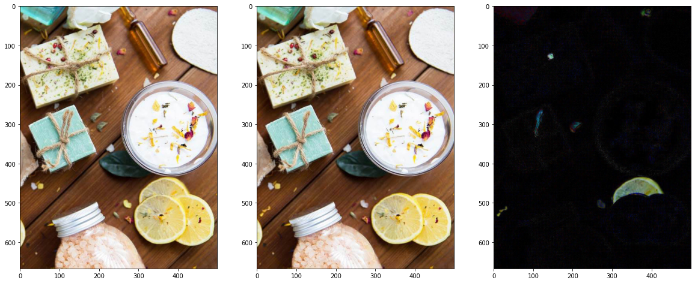
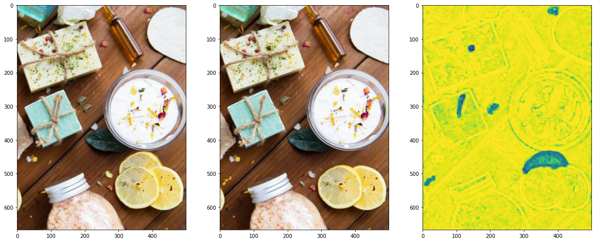
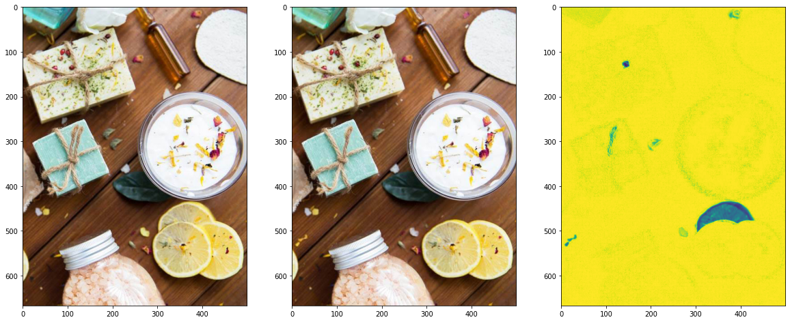
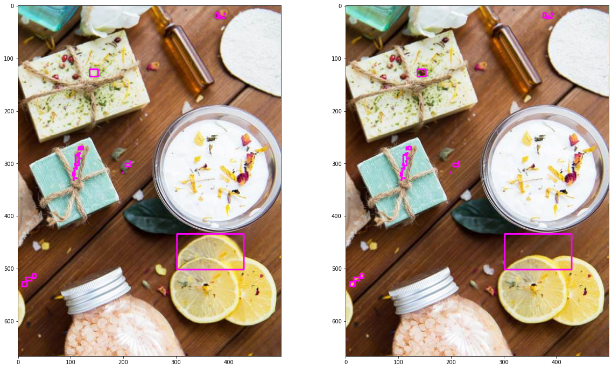

# Spot the Difference 틀린그림찾기

이미지 프로세싱을 사용하여 틀린그림찾기 하는 프로그램

Spot the difference using image processing

## Methods

### Pillow ImageOperations Difference

### Structural Difference

### OpenCV Absolute Difference

### Result

